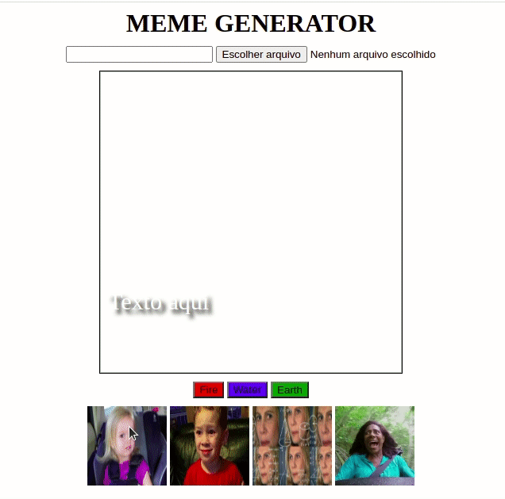

# Boas-vindas ao repositório do Meme Generator!

Projeto desenvolvido no curso da Trybe ao final do bloco 5* do Módulo 1 - Fundamentos do Desenvolvimento Web.  
<strong>*Bloco 5: JavaScript: DOM, Eventos e Web Storage</strong> 
 5.1 - JavaScript - DOM e seletores 
 5.2 - JavaScript - Trabalhando com elementos 
 5.3 - JavaScript - Eventos 
 5.4 - JavaScript - Web Storage 
 5.5 - Fundamentos - JavaScript - Projetos 
 5.5.1 - Projeto - Arte com Pixels 
 5.5.2 - (Bônus) Projeto - Lista de tarefas 
 5.5.3 - (Bônus) Projeto - Meme Generator 
 5.5.4 - (Bônus) Projeto - Adivinhe a Cor 
 5.5.5 - (Bônus) Projeto - Carta Misteriosa  

No projeto <strong>Meme Generator</strong> foi desenvolvido um quadro para geração de meme. No quadro pode ser feito o upload de uma foto, acrescentar legenda e mudar a borda(3 opções). Também tem 4 imagens pré-prontas para o usuário escolher, caso não queira fazer o upload.

